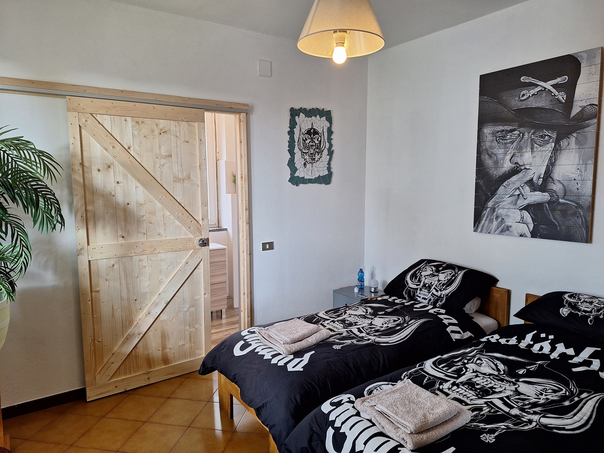

# Moto Pareto

Single webpage for Moto Pareto B&B, Pareto (AL), Piedmont, Italia.

***Author***: Fanna Lautenbach \
***URL***: https://motopareto.com \
***Contact***: fannalautenbach@outlook.com

## Local dev

Because `index.html` loads section files via `fetch()`, it **cannot** be opened directly as a `file://` due to CORS.
Run a local server instead with python for instance:
```bash
python3 -m http.server 7337 
```

## Photos
### Sizes 

- Main background: 1800 × 1200px minimum
- Room overview images: 1200 × 675px (16:9)
- L&P & Argo photo: 800 × 1000px (portrait)
- Live at MP: 600 × 600px (square)

### Add more room photos

Open `sections/rooms-detail.html` and find the gallery block for the room.
Add a new `` to the `.gallery-main` div, update the counter and a matching `<div class="gallery-thumb">` to the filmstrip.

Example:

```html
<!-- In .gallery-main -->

<span class="gallery-counter">1 / 6</span>

<!-- In .gallery-filmstrip-inner -->
<div class="gallery-thumb">
   
</div>
```

### Navigation

### Add a new nav link
Create the html with it's styling. In the css, add a unique identifier (#) for that page. 
In the `nav.html` add a new `<a>` element with the identifying `data-key` attribute. 
Add this key to the `navStrings` object in `lang.js` with its translations. 
Finally, add the new nav html page to `index.html`. 


